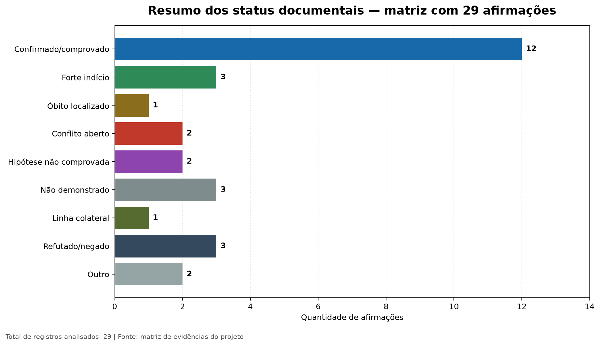

# Relatório-mestre de ancestralidade — Jonathan Robert Silveira de Souza

**Data de corte:** 20 de agosto de 2026

**Escopo:** reconstrução documental das linhas Souza, Schell/Schel e Kenes/Kenne, com foco em Tapes, Vila Cerro Grande, Camaquã e Guaíba, no Rio Grande do Sul.

**Autor:** Manus AI

**Status:** pesquisa documental em andamento; este relatório substitui a leitura fragmentada dos relatórios anteriores, sem apagar os documentos históricos que permanecem no repositório.

## 1. Resposta direta: o que está provado e o que não está

A pesquisa **prova documentalmente** o casamento de **Alvino Paulino de Souza e Rosalina Schell** em 17 de abril de 1955, em Vila Cerro Grande, então 3º distrito de Tapes. O processo APERS nº 180190 também reproduz certidões que identificam Alvino como nascido em 23 de fevereiro de 1897, filho de Geremias de Souza e Anna Joaquina Paulino de Souza, e Rosalina como nascida em 16 de dezembro de 1906, filha de Regino Schell. As certidões ainda apresentam os quatro avós de Alvino e nomes Schell no quadro de ascendentes de Rosalina [1] [2].

A pesquisa também **prova a existência de outro núcleo Schell** em Vila Cerro Grande/Tapes. As habilitações APERS nº 180603 e nº 180674 confirmam, respectivamente, que Alvina Schell e Celanira Schell eram filhas de uma mulher chamada Rosalina Schell. No processo 180674, a mãe é declarada como nascida em 16 de dezembro de 1897. Isso torna **provável** que a Rosalina mãe de Alvina/Celanira seja pessoa distinta da Rosalina nascida em 1906 e casada com Alvino em 1955; contudo, a distinção só será definitiva quando os assentos originais de nascimento, filiação e residência forem localizados [3] [4].

Pelo **testemunho familiar direto e conhecimento pessoal do próprio Jonathan**, os vínculos **Jonathan → Valdeci**, **Jonathan → Rosalvino** e **Jonathan → Carolina** estão confirmados como fatos familiares vividos: Valdeci é o pai de Jonathan; Rosalvino é seu avô; e Carolina é sua avó. Além disso, Jonathan informa que sua própria **certidão de nascimento** registra Valdeci como pai e Rosalvino e Carolina como avós. Essa certidão é uma fonte civil primária privada, disponível ao titular, mas não compartilhada por segurança; por isso, a documentação é considerada confirmada no escopo privado do projeto, sem expor número de termo, livro, folha, cartório ou imagem. A árvore colaborativa não é a base desses vínculos e eles não devem ser descritos como mera hipótese.

O que permanece pendente é apenas a **corroboração documental pública ou arquivística independente** desses vínculos, necessária para auditoria por terceiros, conferência de detalhes formais e preservação institucional. O registro indexado do óbito de José Maria Kenes de Souza em 1971 fornece ainda uma correlação documental independente entre Rosalvino e Carolina como casal com pelo menos um filho [5]. A filiação de Rosalvino a Raimundo José de Souza e Alicia Schell continua documentalmente aberta, porque essa geração anterior não foi confirmada por certidão primária legível.

A pesquisa **não demonstra origem europeia específica**. O sobrenome Schell, as páginas de árvores e o contexto étnico regional não bastam para afirmar Alemanha, Suíça ou qualquer outro país. Para essa conclusão, é necessário um registro brasileiro ou migratório que identifique sem ambiguidade a pessoa da linha direta e declare naturalidade, nacionalidade, imigração, filiação ou procedência estrangeira [6] [7] [8].

> **Conclusão executiva:** a linha familiar **Jonathan → Valdeci → Rosalvino + Carolina** está confirmada pelo conhecimento pessoal direto de Jonathan e pela certidão de nascimento privada do titular, que não será anexada por segurança; a linha brasileira **Alvino–Rosalina–Regino** está documentalmente bem estabelecida; o núcleo Schell local de 1897 está comprovado como família paralela, provavelmente distinto; a documentação pública/arquivística da linha direta permanece opcional e complementar para auditoria externa; a origem europeia permanece não demonstrada.

## 2. Escala de evidência utilizada

A classificação abaixo separa **certeza familiar direta**, **prova documental** e **pistas derivadas**. O testemunho pessoal de Jonathan é a base adequada para afirmar quem é seu pai e quem são seus avós, porque ele conheceu essas pessoas e relata diretamente o vínculo. A documentação cartorial tem outra função: registrar o fato em fonte externa, preservar datas e filiações e permitir auditoria por terceiros. “Não demonstrado” significa que a pesquisa documental ainda não fechou a questão; não significa que o fato familiar vivido foi colocado em dúvida.

| Classe | Significado operacional | Exigência mínima |
|---|---|---|
| **Confirmado por documento privado não compartilhado** | O titular informa que sua certidão civil primária registra o vínculo; o arquivo permanece privado e não auditável por terceiros no repositório. | Existência e conteúdo essencial declarados pelo titular, sem coleta ou publicação do documento. |
| **Confirmado por testemunho familiar direto** | O vínculo é afirmado por conhecimento pessoal direto do descendente ou por testemunho familiar de primeira mão. | Declaração explícita da pessoa de referência, com identificação do vínculo vivido. |
| **Comprovado documentalmente** | O evento ou elo aparece em fonte primária legível, ou em duas fontes independentes coerentes. | Registro civil, habilitação, batismo, casamento, óbito ou documento arquivístico direto. |
| **Fortemente indicado** | Há fonte primária que confirma o evento ou o núcleo familiar, mas ainda falta demonstrar o elo exato entre duas gerações. | Exemplo: óbito que identifica o casal, mas não a filiação do descendente pesquisado. |
| **Hipótese plausível** | A relação aparece em árvore derivada ou índice, com coerência parcial, porém sem fonte primária suficiente e sem testemunho direto equivalente. | Requer registro original e comparação de filiação, localidade, idade e cônjuge. |
| **Provavelmente distinto** | Evidências independentes apontam para homonímia ou conflito estrutural, embora falte o assento definitivo de desambiguação. | Datas, papéis familiares, residências ou filiações incompatíveis. |
| **Não demonstrado** | Não há fonte suficiente para aceitar ou negar a proposição. | Manter separado e definir busca específica. |
| **Refutado como correspondência** | Um candidato foi testado e contradito por filiação, cônjuge, localidade, idade ou evento incompatível. | Exemplo: homônimo de Eva Pereira da Silveira ligado a outro marido e pais. |

## 3. Cadeia de descendência e correlação de cada elo

A tabela é a síntese principal para decidir o que pode ser afirmado hoje. O número de fontes não é uma probabilidade matemática; ele apenas indica a força e a independência das evidências disponíveis.

| Elo ou afirmação | Bases que sustentam | Correlação positiva | Contradições ou lacunas | Resultado atual |
|---|---|---|---|---|
| Jonathan é filho de Valdeci | Certidão de nascimento privada de Jonathan, não compartilhada; conhecimento pessoal direto; árvore FamilySearch apenas como apoio secundário | A certidão do titular registra Valdeci como pai, e Jonathan confirma diretamente o vínculo vivido. | O arquivo não será anexado ao repositório; terceiros não poderão auditar a imagem. | **Confirmado documentalmente em fonte privada e por testemunho direto**. |
| Valdeci é filho de Rosalvino e Carolina | Certidão de nascimento privada de Jonathan, não compartilhada; conhecimento familiar direto; óbito indexado de José Maria como correlação do casal | A certidão do titular registra Rosalvino e Carolina como avós, e Jonathan identifica Valdeci como seu pai. | A certidão de Jonathan não é o assento de nascimento de Valdeci; a imagem não será publicada. | **Confirmado documentalmente em fonte privada e por testemunho direto**. |
| Rosalvino e Carolina eram os avós de Jonathan | Certidão de nascimento privada de Jonathan, não compartilhada; conhecimento pessoal direto; FamilySearch ARK 6YPM-F1JQ, óbito de José Maria, 1971 | A certidão registra ambos como avós; Jonathan conheceu Rosalvino e identifica Carolina como sua avó; o registro de 1971 correlaciona o casal [5]. | A imagem privada não será anexada; o registro indexado de 1971 não nomeia Valdeci como filho. | **Confirmado documentalmente em fonte privada e por testemunho direto; casal corroborado por índice civil**. |
| Rosalvino é filho de Raimundo José e Alicia Schell | Perfil FamilySearch e árvore derivada | A árvore apresenta os nomes como pais e localiza o ramo em Tapes/Cerro Grande. | Não foi localizado nascimento, casamento ou óbito primário de Rosalvino com esses pais; buscas nominais retornaram zero ou resultados não informativos. | **Hipótese não comprovada**. |
| Raimundo é filho de Manoel José de Souza e Maria Candida Tavares | Óbito de Manoel em 1941 (`XSXL-4W2G`, `XSXL-4W25`); óbito de Raimundo em 1983 (`68DD-YZVY/68DD-YZVR`); fontes da rodada de Maria | Raimundo aparece no núcleo de Manoel, e Maria Candida é explicitamente mencionada como mãe de Raimundo no registro de 1983; Maria e Manoel são repetidos como casal em registros de filhos e no óbito de Manoel. | Ainda falta localizar/ler um nascimento ou casamento de Raimundo que declare a filiação sem ruído de indexação. | **Vínculo fortemente indicado; identidade de Maria e o casal parental documentados, filiação direta de Raimundo ainda não fechada em assento próprio**. |
| Maria Candida é a mulher nascida/batizada em Tapes em 1895, esposa de Manoel José e mãe do núcleo Souza | Batismo `XV3V-XJ4` e `6NVN-MNS1`; óbitos de Virgilina `6RM8-X1H5/XSXL-9T17`, Amarolina `65YP-KCW4` e Raimundo `68DD-YZVY`; casamento de Juvelina `XSXL-YW8Z`; óbito de Manoel `XSXL-4W2G`; relatório formal `resultado_maria_candida_2026-08-20.md` | As fontes repetem Maria/Candida Tavares, marido Manoel, filhos, Barão do Triunfo/São Jerônimo/Tapes e os pais Manoel Osorio Tavares e Gertrudes Ignacia Martins. As variantes Cavares/Lavares/Tonares, Tovares/Pavares, Candida Maria Tavares de Carvalho e Dom A foram testadas e classificadas. | Casamento próprio e óbito de Maria em 1956 ainda não foram localizados em imagem inequívoca; algumas fichas têm naturalidade São Paulo e nomes corrompidos. | **Comprovado documentalmente como identidade e núcleo familiar; eventos biográficos específicos ainda abertos**. |
| Manoel Osorio Tavares e Gertrudes Ignacia Martins são os pais de Maria Candida | Batismo `XV3V-XJ4`/`6NVN-MNS1`; óbito de Manoel `XSX8-4D5X`; rodada formal de Gertrudes | O batismo nomeia ambos; o óbito de 1952 identifica Maria como filha e Gertrudes como mãe, além de situar Manoel em Cerro Grande/Tapes. | Nascimento e óbito próprios de Gertrudes não foram localizados; casamento de 1894 é forte, mas o termo original exato ainda não foi transcrito integralmente. | **Filiação de Maria comprovada; Gertrudes encerrada como identidade conjugal/materna, com lacunas próprias registradas**. |
| Alvino casou com Rosalina Schell | Habilitação APERS nº 180190, com certidão final | Nome, cartório, distrito, tramitação e data de 17/04/1955 convergem no mesmo processo primário. | O assento integral ainda pode acrescentar livro, folha, termo e averbações. | **Comprovado** [1] [2]. |
| Alvino nasceu em 23/02/1897 e é filho de Geremias e Anna Joaquina | Certidão de nascimento transcrita no APERS 180190 | Data, distrito, filiação e avós aparecem na certidão anexada. | O assento original ainda deve ser preservado ou conferido em imagem independente. | **Comprovado pelo processo; conferir no assento original** [1]. |
| Rosalina esposa de Alvino nasceu em 16/12/1906 e é filha de Regino Schell | Certidão de nascimento transcrita no APERS 180190 | Data, local de Americana/3º distrito de Tapes, pai Regino e nomes Schell no quadro de avós aparecem no documento. | Mãe e papel exato de Carlos/Anna precisam de leitura do assento original. | **Comprovado como declaração documental do processo** [1]. |
| Rosalina mãe de Alvina e Celanira é a mesma de 1906 | APERS 180603 e 180674 comparados com 180190 | Todas as ocorrências estão em Vila Cerro Grande/Tapes e usam o sobrenome Schell. | Em 180674, a mãe é declarada nascida em 16/12/1897; os papéis familiares são distintos e não há documento de identidade contínua. | **Provavelmente distintas; fusão não permitida** [1] [3] [4]. |
| Alvina é filha de Rosalina Schell | Habilitação APERS nº 180603 | Petição e documentos do processo identificam a maternidade e o núcleo local. | A data da mãe no 180603 exige conferência paleográfica; o assento de Alvina deve ser localizado. | **Maternidade comprovada; identidade da mãe em aberto** [3]. |
| Celanira é filha de Rosalina Schell | Habilitação APERS nº 180674 | Petição, nascimento nº 328 e consentimento assinado por Rosalina em 1953 convergem. | Falta o assento original da mãe para fechar identidade civil completa. | **Maternidade comprovada; identidade da mãe em aberto** [4]. |
| Flauliano é pai de Carolina e Eva é mãe de Carolina | Árvore FamilySearch | A estrutura familiar é coerente e há casamento indicado em 28/07/1948. | Não há habilitação ou certidão primária lida; homônimos de Eva existem. | **Hipótese não comprovada**. |
| Manoel Geraldo é pai de Flauliano e Dorvalina é mãe | Árvore FamilySearch | A linha Kenes é apresentada com nomes e anos aproximados. | Não há registro primário anexado que confirme o casal como pais. | **Hipótese não comprovada**. |
| João Kenne tem origem alemã | Anotação secundária associada a perfil e registro de descendente | A anotação pode indicar uma pista de naturalidade. | Não foi lida a fonte original nem estabelecida a cadeia Manoel Geraldo → João; nacionalidade não aparece em documento primário da linha. | **Não demonstrado**. |
| Cluster Schell/Trott de Gramado–Igrejinha–Taquara pertence à linha de Tapes | Páginas públicas FamilySearch e inventário de fontes de Gramado | Há recorrência regional do sobrenome Schell e registros secundários de pessoas Schell/Trott. | Não há documento que ligue Regino, Rosalina de 1906 ou o núcleo de 1897 a Karl/Anna Becker, Trott ou Theodor. | **Linha colateral não conectada** [11] [12]. |
| A família tem origem alemã, suíça ou europeia específica | Sobrenomes e contexto municipal | Os sobrenomes podem orientar buscas. | Nenhuma fonte consultada declara naturalidade europeia ou imigração de um ancestral da linha direta. | **Não demonstrado** [6] [7] [8]. |

### Visão quantitativa da matriz

A distribuição acima é uma contagem das 24 afirmações da matriz, não uma porcentagem de certeza genealógica. Ela mostra que o projeto possui três vínculos confirmados pela **certidão privada do titular e pelo testemunho familiar direto**, oito afirmações com comprovação documental compartilhada no projeto e ainda concentra hipóteses e lacunas nas gerações anteriores e na origem dos ancestrais Schell/Kenne. A documentação pública adicional da linha direta recente é complementar para auditoria, não uma condição para reconhecer os fatos familiares vividos por Jonathan.

## 4. Desambiguação das Rosalinas Schell

O conflito central do projeto não é apenas a diferença entre 1897 e 1906. A comparação também envolve **papéis familiares, idades, eventos e residência**. Uma Rosalina aparece como mãe de Alvina em 1947 e de Celanira em 1953; a outra aparece como filha de Regino e noiva/esposa de Alvino em 1955. Ambas estão no 3º distrito de Tapes, o que torna a desambiguação obrigatória, não opcional.

| Identidade operacional | Data declarada | Papel documentado | Fonte | Avaliação |
|---|---:|---|---|---|
| **Rosalina B — esposa de Alvino** | 16/12/1906 | Filha de Regino Schell; noiva e esposa de Alvino em 1955 | APERS 180190 | **Identidade documental forte**. |
| **Rosalina A — mãe de Alvina/Celanira** | 16/12/1897 em 180674; data materna do 180603 requer nova leitura | Mãe de Alvina em 1947 e de Celanira em 1953; residente no distrito | APERS 180603/180674 | **Provavelmente distinta da Rosalina B**. |
| **Rosalina Trott/Schell — cluster regional** | 1892–1971 | Associada a Theodor Schell; Gramado/Igrejinha/Taquara | FamilySearch Ancestors, sem conexão primária com Tapes | **Colateral e desconectada**. |

A coincidência do dia e mês — 16 de dezembro — não prova identidade. A diferença de nove anos, os papéis familiares e a ausência de documento que percorra a mesma residência, filiação e cônjuge favorecem a separação. A conclusão correta é **“provavelmente distintas, ainda sem assento definitivo de desambiguação”**, e não “mesma pessoa” nem “identidades definitivamente refutadas”.

## 5. Linhas de prova e linhas de refutação

### 5.1 Hipótese H1 — a linha principal está essencialmente correta

A sequência **Jonathan → Valdeci → Rosalvino** não deve ser apresentada como mera hipótese: ela é **confirmada pelo conhecimento familiar direto de Jonathan e pela sua certidão de nascimento privada**, que não será compartilhada no projeto. O documento registra Valdeci como pai e Rosalvino e Carolina como avós. A árvore colaborativa deixa de ser a base principal desses três vínculos; a busca de registros adicionais passa a ter finalidade de auditoria externa e preservação institucional, não de decidir se os vínculos são verdadeiros.

### 5.2 Hipótese H2 — houve mistura de homônimos na linha principal

A hipótese de mistura de homônimos permanece relevante apenas para as gerações documentais anteriores ou para perfis de terceiros. Ela não deve ser usada para questionar a identidade familiar de Valdeci, Rosalvino ou Carolina, já confirmada pelo conhecimento pessoal direto de Jonathan. Um registro incompatível poderá contradizer uma data, filiação documental ou pessoa homônima apresentada na árvore, mas não apaga o vínculo familiar vivido; nesse caso, será necessário investigar erro registral, variação nominal ou mistura de perfis.

### 5.3 Hipótese H3 — o ramo Schell de Tapes é correto, mas a conexão com Rosalina/Regino está aberta

Esta é a formulação mais segura. O processo 180190 comprova Rosalina B como filha de Regino Schell. Os processos 180603/180674 comprovam outra mulher chamada Rosalina como mãe de Alvina e Celanira. O material não permite conectar Regino à Rosalina A nem ligar qualquer uma dessas mulheres a Rosalvino sem documento intermediário.

### 5.4 Hipótese H4 — há duas Rosalinas Schell em Vila Cerro Grande/Tapes

Esta é a hipótese **mais fortemente sustentada pela pesquisa atual**. A data de 1897 na habilitação de Celanira, a data de 1906 na certidão de Rosalina B, os diferentes papéis familiares e os eventos separados favorecem duas identidades. O assento original de nascimento de cada uma transformará essa forte desambiguação em confirmação definitiva.

### 5.5 Hipótese H5 — o cluster Schell/Trott é colateral

O cluster Gramado–Igrejinha–Taquara deve permanecer desconectado. Repetição do sobrenome e proximidade regional são correlações fracas; faltam nome, filiação, cônjuge, residência e documento que atravesse do cluster para Tapes. Até surgir essa ponte, não há base para afirmar descendência.

## 6. Bases documentais já utilizadas e bases prioritárias

O APERS é a base central porque informa que seus livros civis cobrem 1929–1975 e suas habilitações de casamento abrangem 1890–1985. O FamilySearch confirma que a coleção civil do Rio Grande do Sul contém registros de nascimento, casamento, óbito e índices, mas também avisa que apenas parte está indexada e que imagens adicionais podem ser publicadas. Por isso, busca negativa isolada não refuta um registro [6] [7].

| Base | O que pode provar | Estado no projeto | Prioridade |
|---|---|---|---:|
| **APERS — habilitações 180190, 180603 e 180674** | Casamentos, filiação declarada, naturalidade, residência, consentimentos e testemunhas. | PDFs preservados e parcialmente lidos. | Já utilizada; revisar páginas críticas. |
| **APERS — livros civis de Tapes/Cerro Grande** | Nascimento, casamento, óbito, pais, avós, profissão, residência e averbações. | Buscas nominais incompletas; assentos originais prioritários. | **1** |
| **FamilySearch — Registro Civil RS 1810–2022** | Índices e imagens civis; campos de pais, avós e naturalidade. | Consultas feitas; vários resultados zero ou não informativos. | **1** |
| **FamilySearch — registros diversos RS 1748–1998** | Habilitações e imagens, inclusive quando não há indexação nominal. | Identificada no guia de Tapes. | **2** |
| **Paróquia Nossa Senhora do Carmo, Tapes** | Batismos, casamentos e óbitos paroquiais; testemunhos e padrinhos. | Contato institucional identificado. | **2** |
| **Paróquia São José da Fortaleza, Cerro Grande do Sul** | Livros paroquiais do antigo distrito/localidade. | Contato institucional identificado. | **2** |
| **Cartório/Ofício de Tapes** | Assentos recentes e orientação sobre livros históricos e abrangência territorial. | Mensagem enviada em 20/08/2026; aguardar retorno. | **1** |
| **Arquivo Nacional — SIAN e listas de passageiros** | Entrada por porto, navio, procedência, nacionalidade e destino. | Ainda não acionado por falta de ancestral Schell/Kenne plenamente identificado. | **3** |
| **Arquivo Nacional — RNE e naturalização** | Prontuários de estrangeiros e processos de naturalização. | Rota futura; exige nome completo, filiação e cidade. | **3** |
| **Jornais, obituários e cemitérios** | Idade, parentes, residência, cônjuge, filhos e local de sepultamento. | Ainda sem fonte independente conclusiva para Rosalvino. | **2** |
| **Inventários, processos, notas e registros de terras** | Relações familiares, herdeiros, imóveis e migração regional. | Rota exploratória; não conectar por sobrenome isolado. | **3** |
| **DNA genealógico** | Compartilhamento estatístico com parentes testados; pode corroborar ramos quando há grupos de descendentes documentados. | Nenhum resultado de DNA fornecido ou analisado. | Complementar, nunca substitutivo. |

A fonte histórica do IBGE confirma que, em 1950, Tapes compreendia os distritos de Tapes, Cerro Grande e Vasconcelos. A prefeitura de Cerro Grande informa que o 3º distrito de Tapes foi criado em 13 de maio de 1924 e que a sede foi elevada a vila em 1938. Portanto, a busca de registros de 1947–1955 deve usar simultaneamente “Tapes”, “3º distrito”, “Vila Cerro Grande” e a localidade atual de Cerro Grande do Sul [13] [14].

## 7. Resultados negativos e como interpretá-los

Foram testadas variações nominais para Rosalvino Schell/Schel, Alicia Schell, Regino Schell, Regina Schell, Carlos Schell e Anna Schell em bases abertas, FamilySearch e APERS conforme os registros existentes no projeto. Não foi encontrado resultado público confiável que resolva os elos pendentes. Também foram descartados homônimos como Eva Pereira da Silveira ligada a Cristiano Lopes Altmann, porque os pais, cônjuge e data não correspondem à Eva da árvore Kenes.

Esses resultados são **controles de pesquisa**, não provas de inexistência. A coleção civil do FamilySearch informa que parte dos registros está indexada e que novos registros podem ser adicionados; o APERS informa que os processos estão sendo informatizados e disponibilizados gradualmente. Grafia, variação de sobrenome, registro em imagem, jurisdição histórica e restrição de acesso podem explicar um resultado zero [6] [7].

A única refutação operacional forte realizada até agora é contra a incorporação automática de homônimos. A Eva Pereira da Silveira encontrada em outra habilitação de Tapes possui combinação distinta de pais, cônjuge e data; ela não deve ser usada para provar a linha Kenes. Do mesmo modo, nenhuma pessoa do cluster Schell/Trott foi incorporada à linha de Rosalina B ou à Rosalina A.

## 8. Plano de validação por ordem de retorno documental

A primeira frente pode, se for conveniente ao titular, **documentar externamente uma linha familiar já confirmada**: localizar registros públicos ou arquivísticos que correspondam a **Jonathan → Valdeci** e **Valdeci → Rosalvino/Carolina**. Essa busca não existe para decidir se os vínculos são verdadeiros, porque a certidão privada e o conhecimento direto de Jonathan já os confirmam; serve apenas para preservação institucional, detalhes formais e eventual auditoria por terceiros. A certidão privada não deve ser anexada, enviada ou reproduzida no repositório.

A segunda frente deve resolver **Rosalvino → Raimundo/Alicia**. O alvo mais eficiente é nascimento, casamento ou óbito de Rosalvino em Tapes/Guaíba, seguido de busca do casamento de Raimundo e Alicia. Se o registro de Rosalvino indicar outros pais, a hipótese da árvore será negada para aquele perfil; se indicar Raimundo e Alicia, H1/H3 avançarão para confirmação parcial.

A terceira frente deve recuperar os assentos originais de **Rosalina B (1906)** e **Rosalina A (1897)**. A comparação deverá incluir pais, profissão, residência, testemunhas, cônjuge, filhos e observações marginais. Um documento que atribua a mesma filiação, residência e continuidade conjugal às duas mulheres poderá reabrir a hipótese de identidade; dois assentos com pais, residências ou cônjuges diferentes fecharão a desambiguação.

A quarta frente só deve começar após fechar o elo brasileiro até Regino, Carlos ou Anna. Então será possível consultar SIAN, listas de passageiros, RNE, naturalização e arquivos de imigração com nome, filiação e período. A orientação do Arquivo Nacional informa que a certidão de desembarque exige dados como porto, navio, data, página e ordem; portanto, não é produtivo pesquisar um sobrenome isolado [8].

## 9. Estrutura do projeto após a organização

O repositório passa a ter um índice e documentos de trabalho separados por função. Os arquivos históricos originais continuam em seus caminhos para preservação e auditoria.

| Arquivo | Função |
|---|---|
| `docs/00_indice_projeto_2026-08-20.md` | Mapa de leitura do repositório e ordem recomendada. |
| `docs/01_relatorio_master_ancestralidade_2026-08-20.md` | Síntese analítica e conclusões classificadas. |
| `docs/02_matriz_evidencias_2026-08-20.csv` | Base tabular de afirmações, fontes, correlações e status. |
| `docs/03_mapa_correlacoes_ancestralidade_2026-08-20.md` | Explicação textual e diagrama da rede de evidências. |
| `docs/assets/mapa_correlacoes_ancestralidade_2026-08-20.mmd` | Fonte editável do diagrama. |
| `docs/assets/mapa_correlacoes_ancestralidade_2026-08-20.png` | Renderização visual do mapa. |
| `docs/04_plano_validacao_2026-08-20.md` | Roteiro de buscas e campos a extrair em cada novo documento. |
| `notas_pesquisa_externa_2026-08-20.md` | Caderno de fontes externas e resultados de pesquisa. |
| `gedcom_pesquisa_jonathan/` | GEDCOM independente, fontes, inventário e regras de confiança. |

A validação local do GEDCOM retornou 40 indivíduos, 17 famílias, 28 fontes, zero referências desconhecidas e zero erros de sintaxe. A árvore colaborativa do FamilySearch não foi modificada. O GEDCOM independente deve continuar sendo tratado como árvore de pesquisa, não como prova automática.

## 10. Limitações, privacidade e regra de integridade

O projeto contém nomes e dados de pessoas vivas. A árvore colaborativa não deve ser editada ou mesclada enquanto as fontes não forem conferidas. Informações de parentes vivos devem ser usadas apenas quando necessárias para a pesquisa, e qualquer futura publicação deve remover identificadores e dados pessoais não essenciais. A certidão de nascimento de Jonathan foi deliberadamente mantida fora do repositório: sua existência e conteúdo essencial são registrados apenas por declaração do titular, sem imagem, número, QR code, livro, folha ou cartório.

A regra de integridade principal é: **não fundir Rosalina A com Rosalina B; não ligar o cluster Schell/Trott à linha de Tapes; não converter o sobrenome em nacionalidade; não converter índice em imagem primária; e não tratar busca zero como prova de inexistência**.

## Referências

[1]: ../sources/apers_processo_180190.pdf "Cópia local — APERS, habilitação de casamento nº 180190"
[2]: https://secweb.procergs.com.br/aap/ObtemDadosServlet?metodo=verArquivoPDF&NRO_INT_DOCUMENTO=180190 "APERS — Habilitação de casamento nº 180190"
[3]: ../gedcom_pesquisa_jonathan/apers_processo_180603.pdf "Cópia local — APERS, habilitação nº 180603"
[4]: ../gedcom_pesquisa_jonathan/apers_processo_180674.pdf "Cópia local — APERS, habilitação nº 180674"
[5]: https://familysearch.org/ark:/61903/1:1:6YPM-F1JQ "FamilySearch — óbito de José Maria Kenes de Souza, 29/03/1971"
[6]: https://www.apers.rs.gov.br/acervo-registro-civil "APERS — Acervo de Registro Civil"
[7]: https://www.familysearch.org/en/search/collection/3741255 "FamilySearch — Brazil, Rio Grande do Sul, Civil Registration, 1810–2022"
[8]: https://www.gov.br/arquivonacional/pt-br/servicos/acervos/copy_of_acervos-mais-consultados/entrada-de-estrangeiros "Arquivo Nacional — Entrada de Estrangeiros"
[9]: https://familysearch.org/ark:/61903/1:1:6RM8-HCHX "FamilySearch — óbito de Manoel José de Souza, 21/02/1941"
[10]: https://familysearch.org/ark:/61903/3:1:3QS7-99GW-1966 "FamilySearch — imagem original do registro de Barão do Triunfo, filme 004208553"
[11]: https://ancestors.familysearch.org/en/K2VJ-JTP/catharina-laurinda-trott-1890-1968 "FamilySearch Ancestors — Catharina Laurinda Trott"
[12]: https://memorias.gramado.rs.gov.br/wp-content/uploads/tainacan-items/39/18358/LIVRO-INVENTARIO-2a-Edicao_2026.pdf "Inventário preliminar de acervos e fontes para a história de Gramado e região"
[13]: https://biblioteca.ibge.gov.br/index.php/biblioteca-catalogo?id=32567&view=detalhes "IBGE — Monografia histórica de Tapes"
[14]: https://www.cerrograndedosul.rs.gov.br/municipio/historico/ "Prefeitura de Cerro Grande do Sul — Histórico"
[15]: https://www.familysearch.org/en/wiki/Tapes,_Rio_Grande_do_Sul,_Brazil_Genealogy "FamilySearch Wiki — Tapes, Rio Grande do Sul, Brasil"
[16]: https://www.arquipoa.com/paroquias "Arquidiocese de Porto Alegre — Paróquias de Tapes e Cerro Grande do Sul"
[17]: https://www.familysearch.org/en/blog/civil-registration-and-brazil-records "FamilySearch — Civil Registration and Other Brazilian Records"
[18]: ../pessoas_evidencias.csv "Inventário local de pessoas e evidências"
[19]: ../registro_pesquisa_familysearch.md "Diário local — consulta enviada ao Registro Civil de Tapes em 20/08/2026"

## 11. Atualização de 20/08/2026 — óbito de Rosalvino localizado

A busca paga no Portal Oficial Registro Civil localizou um registro de óbito para **Rosalvino Schell De Souza** no cartório de Guaiba/RS. O resultado informa ocorrido e registro em **17/10/2014**, matrícula `09804601552014400021276001229792`, acervo `01`, livro `00021`, folha `276` e número de registro `0012297` [20].

Esse achado confirma a localização cartorial e a data provável do falecimento, mas ainda é um resultado de pesquisa, não a certidão integral. O painel apresenta uma linha de filiação como `—` e outra como `Alice Schell DE Souza`, sem informar o papel parental. Portanto, Alice deve ser registrada como **nome exibido na filiação do resultado, com relação ainda não determinada**; não deve ser fundida automaticamente com Alicia Schell, Alicia Schell de Souza, Carolina ou qualquer outra pessoa da árvore.

O próximo teste documental é solicitar a certidão ou cópia integral do assento já localizado. A leitura deve extrair idade, naturalidade, filiação completa, estado civil, cônjuge, declarante, residência, profissão, causa ou observações quando disponíveis e averbações. O óbito localizado também oferece uma base mais precisa para pesquisar o casamento de Rosalvino e Carolina.

[20]: ../resultado_obito_rosalvino_guaiba_2026-08-20.md "Resultado localizado do óbito de Rosalvino em Guaíba — Portal Registro Civil"

## 12. Encerramentos formais de Maria Candida e Manoel Osorio — 20/08/2026

A rodada de **Maria Candida Tavares** (`GV46-7JK`) foi formalmente encerrada. A identidade da mulher nascida em 8/4/1895 e batizada em 31/8/1895 em Nossa Senhora das Dores, Tapes, como filha de Manoel Izorio/Osorio Tavares e Geltrudes/Gertrudes Ignacia Martins, fica comprovada por batismo, registros civis de filhos, óbitos de Manoel José e Raimundo e pelo termo paroquial nº 722 de janeiro de 1944. Nesse termo, a qualificação de Cormelina/Carmelina José de Souza lê-se como filha legítima de Manoel José de Souza e sua mulher Dona Maria Candida Tavares [21] [22].

O casamento próprio de Maria Candida e Manoel José e o óbito de Maria indicado para 1/3/1956 continuam sem assento original inequívoco. As formas `Cavares`, `Lavares`, `Tonares`, `Tovares`, `Pavares`, `Candida Maria Tavares de Carvalho` e `Dom A Maria Candida Tavares` foram separadas como variantes de índice ou pistas corrompidas; não foram fundidos homônimos de Lavras do Sul, São Borja ou outros municípios. O arquivo detalhado é `resultado_maria_candida_2026-08-20.md` [21].

A rodada de **Manoel Osorio Tavares de Carvalho** (`9N2V-HKT`) também foi encerrada. O casamento de 31/5/1894 e o batismo de Domingos em 1898 confirmam Manoel como marido de Gertrudes Ignacia Martins, filho de Severino Gulart Pinto e Maria Tavares de Carvalho e integrante do núcleo de Cerro Grande/Tapes. O óbito de 31/5/1952 confirma Manoel como agricultor de 86 anos, natural de Cerro Grande/Tapes, esposo de Gertrudes e pai de Maria Candida; seus pais aparecem como Maria Tavares e Manoel Tavares [23] [24].

| Pessoa ou elo | Estado após a rodada | Próximo uso |
|---|---|---|
| Maria Candida Tavares | Identidade e núcleo familiar comprovados; casamento e óbito próprios ainda abertos | Manter lacunas sem reabrir a identidade; Gertrudes encerrada; avançar para os pais de Manoel e Gertrudes |
| Manoel Osorio Tavares | Identidade, casamento, pais e vários filhos comprovados por registros convergentes | Encerrado; usar Severino/Maria como próximos alvos ancestrais |
| Gertrudes Ignacia Martins | Esposa de Manoel e mãe de Maria confirmada; pais Maximiano/Gregoria identificados; nascimento e óbito próprios não localizados | **Encerrada formalmente**; manter lacunas e homônimos separados |
| Manoel `. Oro Rio Tavares` de `XSXY-SFTK` | Homônimo/misassociação; original é óbito de 1962–1971 em Barra do Ribeiro | Não incorporar à linha principal |
| Manoel Tavares dos Santos de `XSXL-RN52` | Núcleo próprio com filho Gregorio e esposa Maria Gertrudes; possível colateral | Não incorporar sem ponte primária |

As 24 fontes do perfil de Manoel foram abertas e classificadas. As fontes de filhos incluem Domingos, Luiz, Amaniza, João Emílio, Manoel/Manuel, Aparicio, Severino, Ananiza e Antonia, além de pistas indiretas de João Balduino e Ismael. As fontes de 2000 `6ZB6-4VRC` e `6JRK-DP2C` foram diferenciadas: a primeira é o óbito de Luiz Manoel Osorio, cujo original abriu no grupo de Porto Alegre, imagem 17/212; a segunda é uma indexação sem imagem do nascimento de Ismael, apresentado como neto de Manoel [25] [26].

A entrada anômala `XSXY-SFTK`, exibida no perfil como 1810, foi desambiguada pelo original: o grupo é **Barra do Ribeiro — Death Records, 30/12/1962–13/7/1971**, imagem 214/225. O nome corrompido `Manoel . Oro rio Tavares` aparece com esposa Gertrudes Ignácio Marins e filho Domingos Manoel Ozório. A data 1810 e os campos de idade/nascimento são erros de indexação; o núcleo não pode ser o homem falecido em 1952 [27].

As buscas APERS para `Manoel Osorio Tavares`, `Manoel Ozorio Tavares`, `Manoel Izorio Tavares` e `Manoel Osório Tavares` retornaram apenas 4 ou 5 registros homônimos, criminais, inventários ou administrativos, sem o núcleo de Tapes/Cerro Grande. O resultado é negativo controlado, limitado pelo aviso do APERS de que o acervo não está totalmente indexado ou digitalizado [28].

A fila passa agora para **Severino Gulart Pinto** e **Maria Tavares de Carvalho**, pais de Manoel Osorio Tavares, e depois para **Maximiano Martins** e **Gregoria dos Santos**, pais de Gertrudes. Listas de passageiros e registros de imigração permanecem uma rota posterior: os documentos atuais apontam para um núcleo brasileiro em Cerro Grande/Tapes, sem declaração de naturalidade estrangeira, e não há base responsável para pesquisar um sobrenome isolado como prova de origem europeia.

## Referências adicionais do encerramento de 20/08/2026

[21]: ../resultado_maria_candida_2026-08-20.md "Encerramento formal de Maria Candida Tavares"

[22]: https://www.familysearch.org/ark:/61903/3:1:3QHV-B3PW-98LM "FamilySearch — original do termo nº 722, casamento de Cormelina/Carmelina José de Souza"

[23]: ../resultado_manoel_osorio_2026-08-20.md "Encerramento formal de Manoel Osorio Tavares"

[24]: https://www.familysearch.org/ark:/61903/1:1:XSX8-4D5Z "FamilySearch — óbito de Manoel Osorio Tavares, Tapes, 31/05/1952"

[25]: https://www.familysearch.org/ark:/61903/1:1:6ZB6-4VRC "FamilySearch — óbito de Luiz Manoel Osorio, 01/08/2000"

[26]: https://www.familysearch.org/ark:/61903/1:1:6JRK-DP2C "FamilySearch — nascimento indexado de Ismael Ozorio Tavares, 1943"

[27]: https://www.familysearch.org/ark:/61903/3:1:3QS7-99GC-4LNL "FamilySearch — original do homônimo Manoel . Oro rio Tavares, Barra do Ribeiro, imagem 214"

[28]: https://buscadocumentos.apers.rs.gov.br/lista-documentos?semHeaders=true "APERS — resultados das buscas nominais de Manoel Osorio/Ozorio/Izorio/Osório Tavares"

## 13. Encerramento formal de Gertrudes Ignacia Martins — 20/08/2026

A rodada de **Gertrudes Ignacia Martins** (`9N2V-HK1`) foi formalmente encerrada como identidade conjugal e materna. As 25 fontes exibidas no perfil foram classificadas individualmente, incluindo duplicatas matrimoniais, batismos e nascimentos de filhos, casamentos e óbitos tardios, a fonte anômala de 1810 e as associações automáticas de 2000. O resultado detalhado está em `resultado_gertrudes_2026-08-20.md` [29].

O casamento de **31/05/1894**, em Nossa Senhora das Dores, Tapes, confirma Gertrudes como esposa de **Manoel Osorio Tavares de Carvalho** e informa seus pais como **Maximiano Martins** e **Gregoria dos Santos** [30] [31]. Os batismos de Maria Candida, em 1895, e Domingos, em 1898, repetem o núcleo e os pais maternos, com as formas `Geltrudes`, `Martins`, `Maximiano Ignacio Martins`, `Maximiano Martins`, `Gregoria Ignacia dos Santos` e `Gregoria Maria dos Santos` [32] [33]. Registros civis de 1897, 1912 e 1915, casamentos de filhos em 1922, 1924 e 1934, o óbito de Aparicio em 1930, o óbito de Manoel em 1952 e os óbitos de Ananiza e Antonia em 1981 e 1995 fornecem continuidade independente do casal e da maternidade.

A fonte indexada como **1810 `Gertrudes Ignácio Marins`** foi excluída como misassociação: o original pertence a óbitos de Barra do Ribeiro de 1962–1971 e mostra outro núcleo com Manoel e Domingos. O casamento de `Geltrudes Ignacia Martins` em 27/07/1907, embora ocorrido em Barão do Triunfo, foi separado como homônima porque a mulher declarou-se solteira, filha de **Gregoria Maria de Lima** e **Maximiano Jgnacio Martins**, e casou-se com Geltendes Tavares de Carvalho [34]. A associação automática ao perfil não supera essas contradições de filiação, estado civil e cônjuge.

As buscas APERS testaram `Gertrudes Ignacia Martins`, `Gertrudes Ignácio Martins`, `Geltrudes Ignacia Martins`, `Gertrudes Inacia Martins`, `Gertrudes Ignacia Martines`, `Gertrudes Ignacia Martino`, `Gertrudos Ignácio Martino`, `Gertrudes Maria Martins`, `Dom A Gertrudes Maria Martins` e `Gertrudes Martinnascida`. Os resultados foram homônimos ou colaterais de São Sebastião do Caí, Dom Pedrito, São José do Norte, São Leopoldo, Porto Alegre, Taquari e outras comarcas; nenhum combinou o núcleo Tapes/Camaquam–Barão do Triunfo, Manoel Osorio Tavares e os filhos documentados [35].

| Estado da pessoa | Resultado documental | Limite mantido |
|---|---|---|
| Identidade | Gertrudes Ignacia Martins é a mulher casada com Manoel Osorio Tavares em 1894 | A árvore colaborativa não foi usada como prova primária |
| Filiação | Maximiano Martins e Gregoria dos Santos confirmados por casamento e batismos dos filhos | Não foi localizado o batismo próprio de Gertrudes |
| Maternidade | Maria Candida, Domingos, Luiz, Amaniza, Aparicio, Ananiza, Antonia e outros filhos aparecem em registros convergentes | Luiz/Severino em registros de 1934 permanece conflito aberto |
| Cronologia própria | O perfil indica 1874–1952, usado somente como intervalo operacional | Nascimento e óbito próprios ainda não comprovados |
| Próximos alvos | Severino Gulart Pinto, Maria Tavares de Carvalho, Maximiano Martins e Gregoria dos Santos | Cada pessoa deverá ter sua própria rodada e arquivo de encerramento |

A fila operacional passa, portanto, para **Severino Gulart Pinto** e **Maria Tavares de Carvalho**, pais de Manoel Osorio Tavares, e depois para **Maximiano Martins** e **Gregoria dos Santos**, pais de Gertrudes. Listas de passageiros e naturalização somente serão acionadas quando um ancestral estrangeiro ou uma ponte migratória estiver documentalmente delimitada; o sobrenome isolado não será tratado como prova de origem.

[29]: ../resultado_gertrudes_2026-08-20.md "Encerramento formal de Gertrudes Ignacia Martins"
[30]: https://www.familysearch.org/ark:/61903/1:1:XN5L-FDL "Casamento de Manoel Osorio Tavares de Carvalho e Gertrudes Ignacia Martins, 31/05/1894"
[31]: https://www.familysearch.org/ark:/61903/1:1:XN5L-FDV "Duplicata matrimonial de 1894"
[32]: https://www.familysearch.org/ark:/61903/1:1:XV3V-XJ4 "Batismo de Maria Candida Tavares, 1895"
[33]: https://www.familysearch.org/ark:/61903/1:1:XJ72-ZVQ "Batismo de Domingos de Carvalho, 1898"
[34]: https://www.familysearch.org/ark:/61903/1:1:XSF3-16B3 "Casamento da homônima Geltrudes Ignacia Martins, 27/07/1907"
[35]: https://buscadocumentos.apers.rs.gov.br/lista-documentos?semHeaders=true "Resultados APERS das variantes de Gertrudes Martins"
