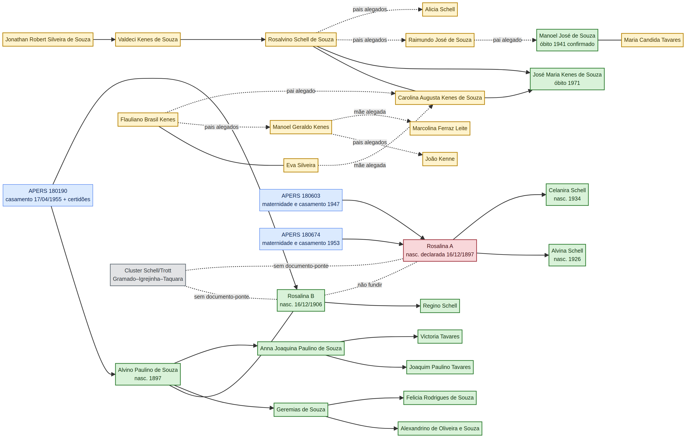

# Mapa de correlações da pesquisa de ancestralidade

Este arquivo transforma a árvore provisória em uma rede de **pessoas, eventos e fontes**. Uma linha contínua no diagrama não significa automaticamente descendência comprovada: cada elo possui um status próprio na matriz `02_matriz_evidencias_2026-08-20.csv`.

## Como interpretar

| Marcador | Interpretação |
|---|---|
| **Verde** | Elo ou evento confirmado por fonte primária ou por registro documental direto. |
| **Amarelo** | Hipótese ou relação forte ainda dependente de registro adicional. |
| **Vermelho** | Conflito de identidade, homônimo ou fusão não permitida. |
| **Cinza** | Cluster colateral ou rota de pesquisa ainda sem conexão com a linha direta. |

## Correlações positivas mais fortes

A correlação mais forte do projeto é o conjunto formado por **Alvino Paulino de Souza + Rosalina Schell**, a habilitação de casamento APERS nº 180190, a data de 17/04/1955, a localidade de Vila Cerro Grande e as certidões anexadas com filiação. É um núcleo documental coerente e primário.

A segunda correlação forte é o núcleo **Rosalina A → Alvina/Celanira**, sustentado por dois processos distintos, de 1947 e 1953, ambos no 3º distrito de Tapes. Esse conjunto prova a maternidade, mas não identifica a mãe como a mesma Rosalina B de 1906.

A terceira correlação é **Rosalvino + Carolina → José Maria**, baseada no registro civil indexado de 1971. Ela confirma a existência do casal e de ao menos um filho, mas não fecha a filiação de Valdeci nem os pais de Rosalvino.

## Correlações que não podem ser usadas como prova

A repetição de Schell em Tapes, Gramado, Igrejinha e Taquara é uma correlação nominal e regional, não uma prova de parentesco. A coincidência do dia e mês de nascimento das duas Rosalinas não supera a diferença de nove anos e os papéis familiares incompatíveis. Da mesma forma, a recorrência dos sobrenomes Kenes/Kenne e Schell em páginas colaborativas não substitui certidão ou assento original.

## Diagrama

A fonte editável está em `docs/assets/mapa_correlacoes_ancestralidade_2026-08-20.mmd` e a renderização PNG em `docs/assets/mapa_correlacoes_ancestralidade_2026-08-20.png`.

## Regra de atualização

Sempre que um novo documento for localizado, deve-se atualizar primeiro a matriz CSV, depois o diagrama e por fim o relatório-mestre. A inclusão de uma pessoa deve registrar sua fonte, o tipo de fonte, a relação específica e os elementos de desambiguação. Nenhum indivíduo do cluster Schell/Trott deve ser ligado à linha de Tapes sem documento-ponte explícito.
